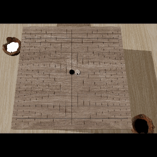
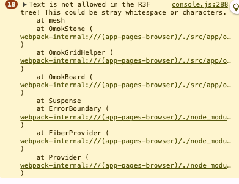

# 3d-omock



### 1. 오목판 모델링

- **Three.js**를 사용하여 오목판, 다리, 그리드 라인, 화점, 방석을 구현.
- **React Three Fiber**를 활용하여 오목판의 3D 환경을 구성.
- 오목판은 **Wooden Texture**를 사용하여 나무질감을 표현


### 2. 그리드의 꼭지점 메쉬를 생성 및 9개의 화점을 생성

- 생성된 포인트들은 y 좌표가 3.805로 설정되어 있으며, 이 위치에 맞춰 배치
- **화점**은 총 9개이며 반환되는 값은 [x, y, z] 형식의 좌표 배열


### 3. 오목게임룰을 적용하기 위한 포인트 설정

- 그리드 라인을 생성하고, `size`와 `spacing`을 입력받아 계산된 좌표에 따라 꼭지점 메쉬 생성.
- 각 꼭지점마다 _오목판의 각 꼭지점 좌표를 생성하는 함수. 오목판의 크기와 간격에 따라 점들을 생성_
- 돌 5개가 이어지면 게임이 끝나는 규칙이 적용


## Todo

- **승패 로직:** 게임 승리 조건을 어떻게 처리할지, 규칙에 따른 승패 로직을 구현해야함

  - **게임 진행 상태 관리:** 각 유저의 차례를 어떻게 구분할지, 턴이 끝났을 때 상태를 어떻게 유지할지 ?

    - 검은돌 3x3 가능 여부 등의 룰을 정확하게 체크해야함 (검은 돌은 3x3 가능, 백돌은 불가능)
    - ex) 오목돌을 두는 시간은 30초로 제한
    - 5돌시 게임승리 (6돌, 7돌등 5돌이상 x)

- **알림 기능:** 유저가 돌을 놓거나 상대가 돌을 놓았을 때, 실시간으로 알림을 받을 수 있는 기능이 필요함

- **상태 저장 및 불러오기:** 게임을 중간에 저장하거나 종료 후 다시 불러올 수 있도록 하는 기능이 필요

  - `zustand`를 사용하여 상태를 저장하고 관리.

- **실시간 데이터 전송 최적화**: Socket.io로 실시간 데이터를 효율적으로 주고받을 수 있도록 해야함

  - 실시간 통신

    이 필요한 경우

    - 예: 실시간 채팅, 게임 진행 상황, 알림 등

  - 이벤트 기반 데이터 전송이 필요한 경우

    - 예: 유저의 행동(돌 놓기 등)을 즉시 상대방에게 전달할 때

- **AI 상대 기능**:

  - 유저가 혼자서 게임을 진행할 수 있도록 AI 상대를 추가.
  - AI가 오목 규칙에 맞게 돌을 놓고 유저와 대결할 수 있도록 알고리즘 개발.

## ERROR

mesh : 불필요한 주석 제거

- `mesh`와 `primitive` 컴포넌트에서 불필요한 텍스트와 공백 제거
- `Text is not allowed in the R3F tree` 오류를 해결하기 위해 JSX 문법을 정리
  

```javascript
<mesh>
  <cylinderGeometry args={[0.44, 0.45, 0.1, 32]} />
  {/* roughness: 0.3 - 약간의 거칠기 추가, metalness: 0.2 - 금속성 추가 */}
  <meshStandardMaterial color={color} roughness={0} metalness={2} />
</mesh>
```
